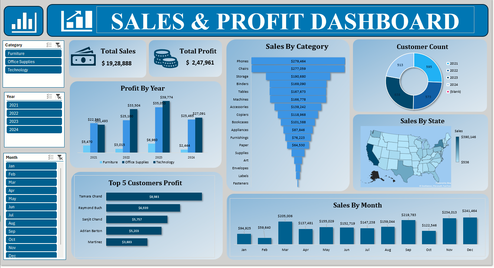

# Sales and Profit Dashboard (Excel)

## 📊 Project Overview
This project presents an interactive Sales & Profit Dashboard built using Microsoft Excel to analyze business performance across different categories, years, customers, and states.

The dashboard helps track total sales, total profit, yearly trends, customer performance, and regional distribution through dynamic visualizations and slicers.

## 📊 Dashboard Preview

## 🛠 Tools & Features Used
- Pivot Tables
- Pivot Charts
- Slicers (Category, Year, Month)
- Map Chart (Sales by State)
- KPI Cards (Total Sales & Total Profit)
- Calculated Fields
- SUMIFS & Aggregation Functions
- Conditional Formatting

## 📈 Key Insights
- Total Sales: $19,28,888
- Total Profit: $2,47,961
- Technology category generates the highest sales.
- Sales show strong performance growth in 2023.
- Q4 months (Oct–Dec) contribute the highest revenue.
- Top 5 customers significantly impact overall profit.
